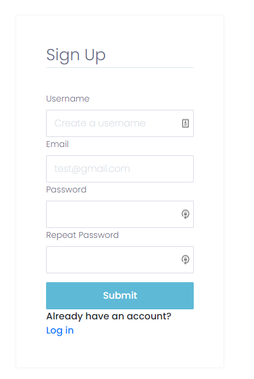
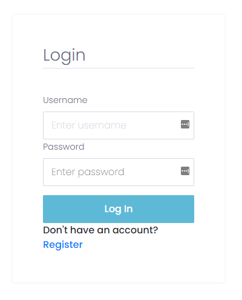
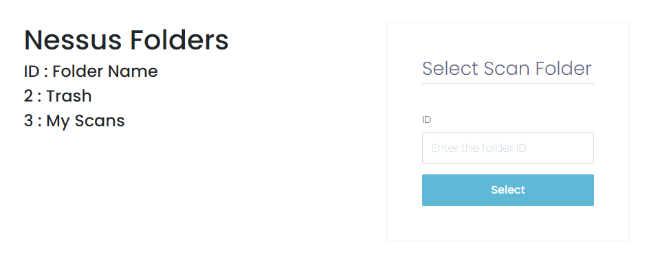
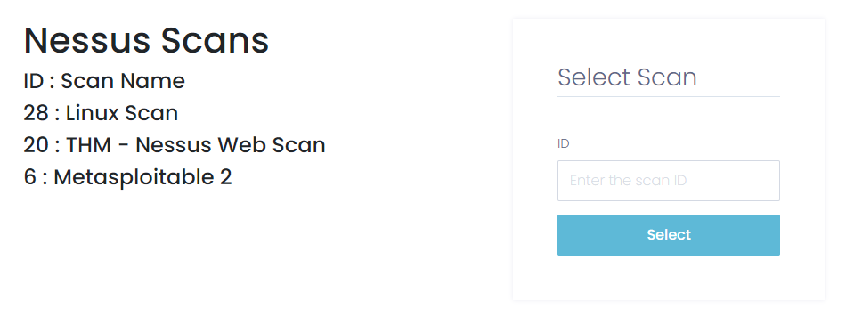
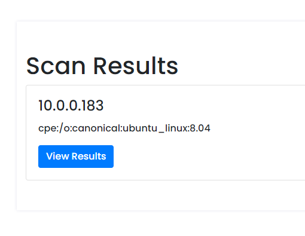
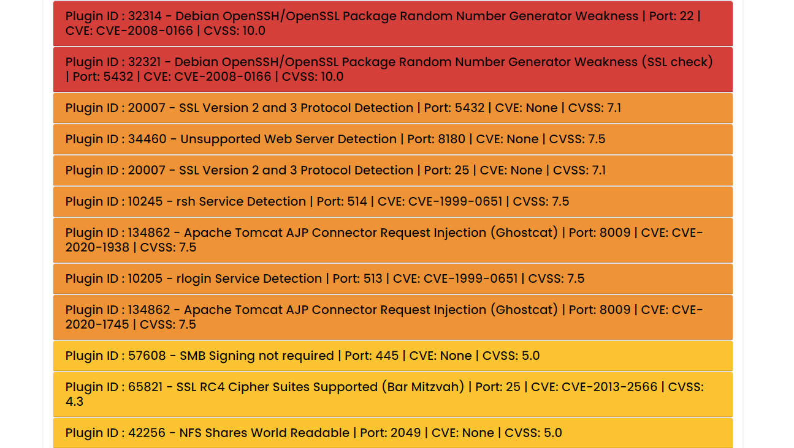
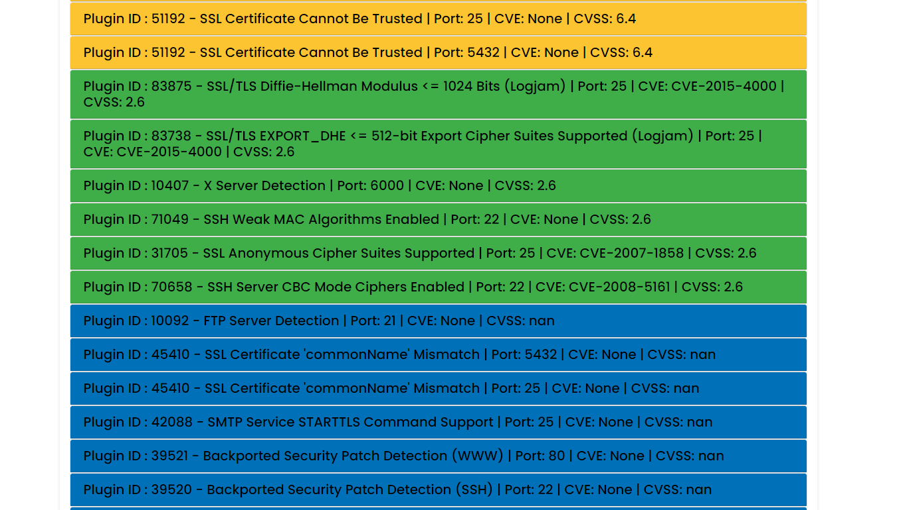
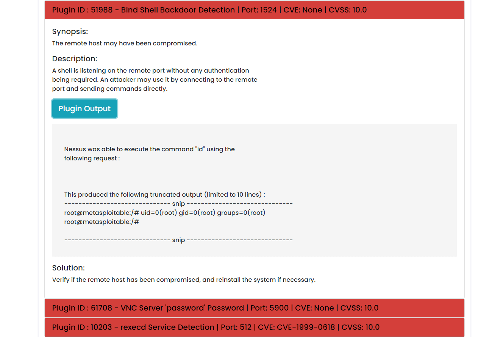
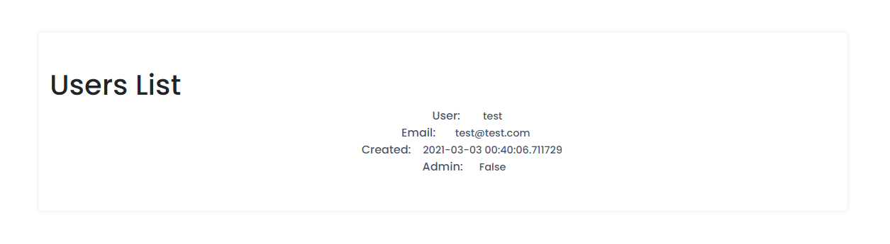

# NessusVisualizer

Web application to visualize Nessus scan results in a concise, succinct fashion.

[](https://github.com/SchwartzKamel/NessusVisualizer/actions/workflows/ci.yml)
[](https://github.com/SchwartzKamel/NessusVisualizer/actions/workflows/security.yml)
[](https://github.com/SchwartzKamel/NessusVisualizer/actions/workflows/docker.yml)

Video Demo - [Here](https://youtu.be/8ZbkkKt7Sns)

## Getting Started

### Prerequisites

This app was built with the following:

```
Ubuntu 24.04 (or Docker)
Python 3.12
```

You will need to setup a [Nessus scanner](https://www.tenable.com/products/nessus), and have at least one scan result.

Additionally, you will need either:
- A Redis instance (local or [Redis Cloud](https://redis.com/try-free/))
- Docker and Docker Compose (recommended for easy setup)

## Quick Start with Docker (Recommended)

The easiest way to run NessusVisualizer is with Docker Compose:

1. Clone the repository:
```bash
git clone https://github.com/SchwartzKamel/NessusVisualizer.git
cd NessusVisualizer
```

2. Create a `.env` file with your configuration:
```bash
SECRET_KEY=your-secret-key-here
NESSUS_URL=https://your-nessus-scanner:8834
NESSUS_USER=your-nessus-username
NESSUS_PASS=your-nessus-password
```

3. Start the application:
```bash
docker compose up -d
```

4. Access the application at `http://localhost:5000`

### Docker Commands

```bash
# Start services
docker compose up -d

# View logs
docker compose logs -f

# Stop services
docker compose down

# Rebuild after changes
docker compose up -d --build
```

## Manual Installation

### Installing with uv (Recommended)

[uv](https://github.com/astral-sh/uv) is a fast Python package manager:

```bash
# Install uv
curl -LsSf https://astral.sh/uv/install.sh | sh

# Create virtual environment and install dependencies
uv venv
source .venv/bin/activate
uv pip install -r requirements.txt
```

### Installing with pip

Clone the application and create your virtual environment:

```bash
pip install -r requirements.txt
```

Run the setup script:

```bash
python setup.py
```

Answer the prompts to configure the .env file

In case you want to create this file manually, use the below template (DEV_DATABASE_URI is optional)

```
SECRET_KEY=<RANDOM_STRING>
FLASK_APP=wsgi.py
PROD_DATABASE_URI=sqlite:////<FULL_PATH_TO_FILE>
DEV_DATABASE_URI=sqlite:////<FULL_PATH_TO_FILE>
SESSION_TYPE=redis
REDIS_URI=redis://:[password]@[host_url]:[port]
NESSUS_URL=https://<NESSUS_SCANNER_IP>:8834
NESSUS_USER=<SCANNER_USERNAME>
NESSUS_PASS=<SCANNER_PASSWORD>
```

Start the server

```
python wsgi.py
```

### Deployment

You can pass this app to [Gunicorn_3](https://gunicorn.org/), [uWSGI](https://uwsgi-docs.readthedocs.io/en/latest/), [Waitress](https://docs.pylonsproject.org/projects/waitress/en/latest/), etc. and for extending usage, install [tmux](https://github.com/tmux/tmux/wiki) and start the server from there. When you disconnect the tmux session, the web app will be running in the background.

## Usage

Connect to the server on port 5000 and register your account (this only resides on the local database).



After that you can log in.



Type in the folder ID you want to browse.



Type in the scan ID you want to download (currently only one scan result may be accessed at a time, the database is not setup to handle more than that).



Once the data has downloaded you can view the scanned hosts by IP and if plugin 45590 (Operating System Common Platform Enumeration) ran it'll be included or notify you that it wasn't in the scan results.



Plugins are listed in order of severity and are color coded as they would be from the Nessus scanner.

- Critical (Red)
- High (Orange)
- Medium (Yellow)
- Low (Green)
- Informational (Blue)




Plugin "titles" follow the pattern of <PLUGIN_ID> | <PLUGIN_NAME> | <PORT> <CVE_IF_EXISTS> | <CVSS_SCORE>

Each plugin is on a toggle button to reveal more details in the following order:

- Simple description
- Full description
- Plugin output
- A solution to patch the vulnerability if one exists

Additionally the 'Plugin Output' is on a toggle button as some plugins contain significant amounts of data. The background element is a different shade so you can easily distinguish it from the other information.



Finally there is a section to view all registered users (more features utilizing this may be built upon, e.g. multiple users each able to analyze different scan results rather than sharing the singular result).



## Development

### Running Tests

```bash
# Install test dependencies
uv pip install pytest pytest-cov pytest-flask

# Run all tests
python -m pytest tests/ -v

# Run tests with coverage
python -m pytest tests/ --cov=app --cov-report=term-missing
```

### Code Quality

```bash
# Install dev dependencies
uv pip install ruff mypy

# Run linter
ruff check app/

# Run formatter
ruff format app/
```

## CI/CD

This project uses GitHub Actions for continuous integration:

- **CI/CD Pipeline**: Runs linting, tests, and Docker build on every push
- **Security Scan**: Weekly vulnerability scanning with Safety, Bandit, and Trivy
- **Docker Build**: Builds and publishes Docker images to GitHub Container Registry

## License

This project is licensed under the MIT License - see the [LICENSE](LICENSE) file for details.
