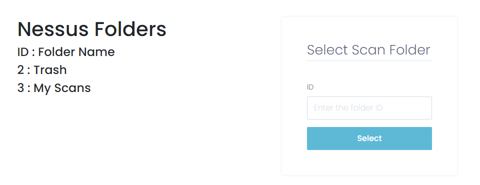

# NessusVisualizer

Web application to visualize Nessus scan results in a concise, succinct fashion.

## Getting Started

### Prerequisites

This app was built with the following:

```
Ubuntu 20.04
Python 3.8
```

You will need to setup a [Nessus scanner](https://www.tenable.com/products/nessus), and have at least one scan result.

Additionally, you will need to setup a [RedisLabs](https://redislabs.com/try-free/) account

### Installing

Clone the application (git clone or download and unpack the zip) and create your virtual environment (or install Poetry and use `poetry shell`)

Install the dependencies

```
pip install -r requirements.txt
```

Run the setup script

```
python setup.py
```

Answer the prompts to configure the .env file

In case you want to create this file manually, use the below template (DEV_DATABASE_URI is optional)

```
SECRET_KEY=<RANDOM_STRING>
FLASK_APP=wsgi.py
PROD_DATABASE_URI=sqlite:////<FULL_PATH_TO_FILE>
DEV_DATABASE_URI=sqlite:////<FULL_PATH_TO_FILE>
SESSION_TYPE=redis
REDIS_URI=redis://:[password]@[host_url]:[port]
NESSUS_URL=https://<NESSUS_SCANNER_IP>:8834
NESSUS_USER=<SCANNER_USERNAME>
NESSUS_PASS=<SCANNER_PASSWORD>
```

Start the server

```
python wsgi.py
```

### Deployment

You can pass this app to Gunicorn 3, uWSGI, Waitress, etc. and for extending usage, install tmux and start the server from there. When you disconnect the tmux session, the web app will be running in the background.

## Usage

Connect to the server on port 5000 and register your account (this only resides on the local database)


After that you can log in


Type in the folder id you want to browse



Type in the scan id you want to download (currently only one scan result may be accessed at a time, the database is not setup to handle more than that)


Once the data has downloaded you can view the scanned hosts by IP and if plugin 45590 (Operating System Common Platform Enumeration) ran it'll be included or notify you that it wasn't in the scan results


Plugins are listed in order of severity (Critical, High, Medium, Low, Informational) and are color coded as they would be from the Nessus scanner


Plugin "titles" follow the pattern of <PLUGIN_ID> | <PLUGIN_NAME> | <PORT> | <CVE_IF_EXISTS> | <CVSS_SCORE>

Each plugin is on a toggle button to reveal more details in the following order:

- Simple description
- Full description
- Plugin output
- A solution to patch the vulnerability if one exists

Additionally the 'Plugin Output' is on a toggle button as some plugins contain significant amounts of data. The background element is a different shade so you can easily distinguish it from the other information.


Finally there is a section to view all registered users (more features utilizing this may be built upon, e.g multiple users each able to analyze different scan results rather than sharing the singular result)


